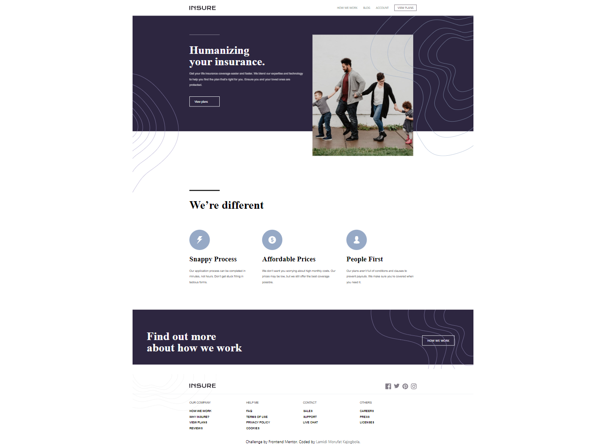
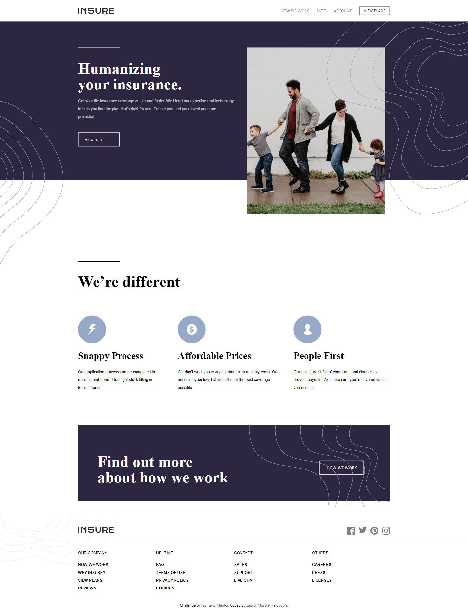
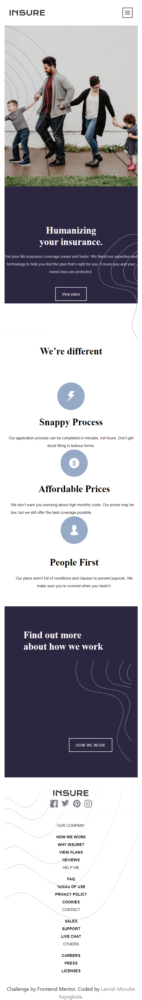

# Frontend Mentor - Insure landing page solution

This is a solution to the [Insure landing page challenge on Frontend Mentor](https://www.frontendmentor.io/challenges/insure-landing-page-uTU68JV8). Frontend Mentor challenges help you improve your coding skills by building realistic projects. 

## Table of contents

- [Overview](#overview)
  - [The challenge](#the-challenge)
  - [Screenshot](#screenshot)
  - [Links](#links)
- [My process](#my-process)
  - [Built with](#built-with)
- [Author](#author)

## Overview

### The challenge

Users should be able to:

- View the optimal layout for the site depending on their device's screen size
- See hover states for all interactive elements on the page

### Screenshot

### Links

- Solution URL: [code](https://github.com/Ehmkayel/digital-notebook/tree/main/Project-day56/insure-landing-page-master)
- Live Site URL: [live site URL](https://insure-r.netlify.app/)

## My process

### Built with

- Semantic HTML5 markup
- TailwindCSS custom properties
- Flexbox
- TailwindCss
- Mobile-first workflow
- JavaScript

## Author

 - Linkedin- [Morufat-Lamidi](https://linkedin.com/in/morufat-lamidi)
 - Frontend Mentor - [@Ehmkayel](https://www.frontendmentor.io/profile/Ehmkayel)
 - Twitter - [@kamalehmk](https://www.twitter.com/kamalehmk)
 - Gmail- [Mail](mailto:lamidimorufat0@gmail.com);
